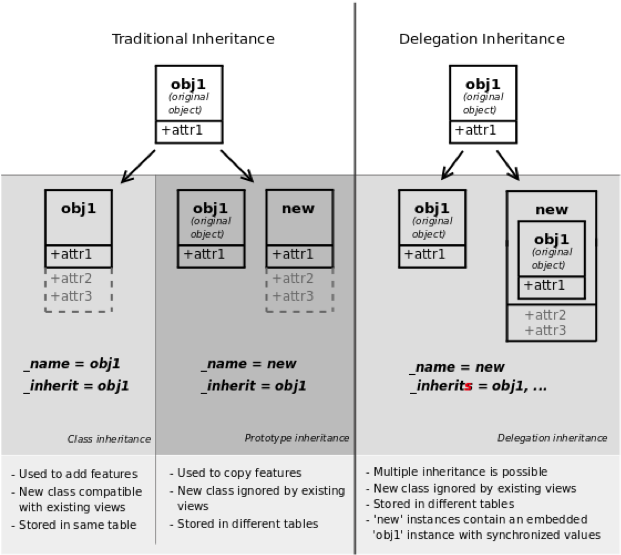

ORM
===

Class structure
---------------

Business objects are declared as Python classes inheriting from the **orm.Model** class, which makes them part of the OpenObject Model, and magically persisted by the ORM layer. Predefined attributes are used in the Python class to specify a business object's characteristics for the ORM.

orm.Model attributes for business objects
^^^^^^^^^^^^^^^^^^^^^^^^^^^^^^^^^^^^^^^^^

_name (required)
    business object name, in dot-notation (in module namespace)

_columns (required)
    dictionary {field names: object fields declarations}

_defaults
    dictionary: {field names: default values}. A default value can be a function or a literal.

    Example::

        _defaults['name'] = lambda self, cr, uid, context: 'eggs'

_inherit
    _name of the parent business object (for prototype inheritance)

_inherits
    for multiple / instance inheritance mechanism: dictionary mapping the _name of the parent business objects to the names of the corresponding foreign key fields to use

_constraints
    list of tuples defining the Python constraints, in the form (func_name, message, fields). (message may be callable)

_sql_constraints
    list of tuples defining the SQL constraints, in the form
    (name, sql_def, message). (message may be callable)

_order
    Name of the field used to sort the records in lists (default: 'id')

_auto
    if True (default) the ORM will create the database table – set to False to create your own table/view within the init() method. (Rarely used)

_log_access
    If True (default), 4 fields (create_uid, create_date, write_uid, write_date) will be used to log record-level operations, made accessible via orm's perm_read() function.  (Rarely used)

_rec_name
    Alternative field to use as name, used by orm's name_get() (default: 'name') (Rarely used)

Inheritance mechanisms
----------------------

ORM Fields
----------
Objects may contain 3 types of fields: simple, relational, and functional. Simple types are: integers, floats, booleans, strings, etc. Relational fields represent the relationships between objects: one2many, many2one and many2many field. Functional fields are calculated on-the-fly as Python functions, but value can be stored in the database (for example for filtering).

Common attributes supported by all fields
^^^^^^^^^^^^^^^^^^^^^^^^^^^^^^^^^^^^^^^^^

• string:
    field label (**required**)

• required:
    True if mandatory

• readonly:
    True if not editable

• help:
    help tooltip

• context:
    dictionary with contextual parameters (for relational fields)

• select:
    True to optimize for list filtering (with database index), to include in search views

• change_default:
    True if field should be usable as condition for default values in clients

• states:
    dynamic changes to this field's common attributes based on the state field

Simple fields
^^^^^^^^^^^^^

boolean(...) integer(...) date(...) datetime(...) time(...):
    Example::

        {
            'active': fields.boolean('Active'),
            'priority': fields.integer('Priority'),
            'start_date': fields.date('Start Date')
        }

char(string, size, translate=False, ...) text(string, translate=False, ...)
    Text-based fields
        • translate: True if field values can be translated by users
        • size: maximum size for char fields

float (string, digits=None, ...)
    Floating-point value with arbitrary precision and scale
        • digits: tuple (precision, scale). If digits is not provided, it's a float, not a decimal type.

selection(values, string, ...)
    Field allowing selection among a set of predefined values
        • values: list of values (key-label tuples) or function returning such a list (required)

binary(string, filters=None, ...)
    Field for storing a file or binary content.
        • filters: optional filename filters

    Example::

        {
            'picture': fields.binary('Picture', filters='*.png,*.gif')
        }

reference(string, selection, size, ...)
    Field with dynamic relationship to any other object, associated with an assistant widget
        • selection: model _name of allowed objects types and corresponding label (same format as values for selection fields) (required)
        • size: size of text column used to store it (as text: 'model_name,object_id') (required)

    Example::

        {
            'contact': fields.reference('Contact', [
                ('res.partner', 'Partner'),
                ('res.partner.contact', 'Contact')
            ], size=None)
        }

Relational fields
^^^^^^^^^^^^^^^^^

All relational fields support **domain** attribute:
    optional restriction in the form of arguments for search (see search())

many2one(obj, ondelete='set null', ...)
    Relationship towards a parent object (using a foreign key)
        • obj: _name of destination object (**required**)
        • ondelete: deletion handling, e.g. *'set null'*, *'cascade'*, see PostgreSQL documentation

one2many(obj, field_id, ...)
    Virtual relationship towards multiple objects (inverse of many2one)
        • obj: _name of destination object (**required**)
        • field_id: field name of inverse many2one, i.e. corresponding foreign key (**required**)

many2many(obj, rel, field1, field2, ...)
    Bidirectional multiple relationship between objects
        • obj: _name of destination object (**required**)
        • rel: relationship table to use (**required**)
        • field1: name of field in rel table storing the id of the current object (**required**)
        • field2: name of field in rel table storing the id of the target object (**required**)

Functional fields
^^^^^^^^^^^^^^^^^

function(fnct, arg=None, fnct_inv=None, fnct_inv_arg=None, type='float', fnct_search=None, obj=None, method=False, store=False, multi=False,...)
    Functional field simulating a real field, computed rather than stored
        • fnct: function to compute the field value (**required**)

    def fnct(self, cr, uid, ids, field_name, arg, context)
        returns a dictionary { ids→values } with values of type type
            • fnct_inv: function used to write a value in the field instead

    def fnct_inv(obj, cr, uid, id, name, value, fnct_inv_arg, context)
        • type: type of simulated field (any other type besides 'function')
        • fnct_search: function used to search on this field

    def fnct_search(obj, cr, uid, obj, name, args)
        returns a list of tuples arguments for search(), e.g. [('id', 'in', [1, 3, 5])]
            • obj: model _name of simulated field if it is a relational field
            • store, multi: optimization mechanisms (see usage in Performance Section)

related(f1, f2, ..., type='float', ...)
    Shortcut field equivalent to browsing chained fields
        • f1, f2, ...: chained fields to reach target (f1 **required**)
        • type: type of target field

property(obj, type='float', view_load=None, group_name=None, ...)
    Dynamic attribute with specific access rights
        • obj: object (**required**)
        • type: type of equivalent field

Special / Reserved field names
^^^^^^^^^^^^^^^^^^^^^^^^^^^^^^

A few field names are reserved for pre-defined behavior in OpenObject. Some of them are created automatically by the system, and in that case any field with that name will be ignored.

=============   ===========
field name      description
=============   ===========
id              unique system identifier for the object (created by ORM, do not add it)
name            defines the value used by default to display the record in lists, etc.
                if missing, set **_rec_name** to specify another field to use for this purpose
active          defines visibility: records with active set to False are hidden by default
sequence        defines order and allows drag&drop reordering if included in list views
state           defines life-cycle stages for the object, used for workflows
parent_id       defines tree structure on records, and enables child_of operator
parent_left     used in conjunction with **_parent_store** flag on object, allows faster access to tree structures (see also Performance Optimization section)
parent_right    used in conjunction with **_parent_store** flag on object, allows faster access to tree structures (see also Performance Optimization section)
create_date     date of creation
create_uid      record creator
write_date      last update date of the record
write_uid       record last updater
=============   ===========

create_date, create_uid, write_date, write_uid are disabled if **_log_access** flag is set to False

ORM Methods
-----------
Inheriting from the orm.Model class makes all the ORM methods available on business objects. These methods may be invoked on the self object within the Python class itself (see examples in the table below), or from outside the class by first obtaining an instance via the ORM pool system.

To obtain a model class from anywhere self.pool['model_name'] is used. It can be a good idea to assign it to a variable::

    model_name_obj = self.pool['model_name']

Common parameters, used by multiple methods:
    • cr:
        database connection (cursor)

    • uid:
        id of user performing the operation
    • ids:
        list of record ids, or single integer when there is only one id
    • context:
        optional dictionary of contextual parameters, such as user language::

            {'lang': 'en_US', ... }

create(cr, uid, values, context=None)
    Creates a new record with the specified value. Returns: **id** of the new record
        • values: dictionary of field values for the record

    Example::

        idea_id = self.create(cr, uid, {
            'name': 'Spam recipe',
            'description': 'spam & eggs',
            'inventor_id': 45
        })

search(cr, uid, args, offset=0, limit=None, order=None, context=None, count=False)
    Returns: list of ids of records matching the given criteria
        • args: list of tuples specifying search criteria
        • offset: optional number of records to skip
        • limit: optional max number of records to return
        • order: optional columns to sort by (default: self._order)
        • count: if True, returns only the number of records matching the criteria, not their ids

    Search criteria is defined in polish notation

    Operators:
        =, !=, >, >=, <, <=, like, ilike, =like, =ilike, in, not in, child_of, parent_left, parent_right

    Prefix operators:
        '&' (default), '|', '!'

    Example. Fetch non-spam partner shops + partner 34::

        ids = self.search(
            cr,
            uid,
            [ '|', ('partner_id', '!=', 34), '!', ('name', 'ilike', 'spam')],
            order='partner_id'
        )

browse(cr, uid, ids, context=None)
    Fetches records as objects, allowing to use dot-notation to browse fields and relations
    Returns: object or list of objects requested

    Example::

        idea = self.browse(cr, uid, 42)
        print 'Idea description:', idea.description
        print 'Inventor country code:', idea.inventor_id.address[0].country_id.code
        for vote in idea.vote_ids:
            print 'Vote %2.2f' % vote.vote

read(cr, user, ids, fields=None, context=None)
    Returns: list of dictionaries with requested field values
        • fields: optional list of field names to return (default: all fields)

   Example::

        results = self.read(cr, uid, [42, 43], ['name', 'inventor_id'])
        print 'Inventor:', results[0]['inventor_id']

write(cr, uid, ids, values, context=None)
    Updates records with given ids with the given values. Returns: True
        • values: dictionary of field values to update

    Example::

        self.write(cr, uid, [42, 43], {
            'name': 'spam & eggs',
            'partner_id': 24
        })

copy(cr, uid, ids, defaults, context=None)
    Duplicates record with given id updating it with defaults values. Returns: True
        • defaults: dictionary of field values to change before saving the duplicated object

    Example::

        self.write(cr, uid, [42, 43], {
            'name': 'spam & eggs',
            'partner_id': 24
        })

unlink(cr, uid, ids, context=None)
    Deletes records with the given ids Returns: True

    Example::

        self.unlink(cr, uid, [42, 43])

default_get(cr, uid, fields, context=None)
    Returns: a dictionary of the default values for fields (set on the object class, by the user preferences, or via the context)
        • fields: list of field names

    Example::

        defs = self.default_get(cr, uid, ['name', 'active'])
        # active should be True by default
        assert defs['active']

log(cr, uid, id, message, context, details=True)
    Returns: id of the record created in res.log
        • message: message to write
        • context: if passed then context is stored in db

    Example::

        self.log(cr, uid, st.id, _('Statement %s is confirmed, journal items are created.') % (st_number,))

perm_read(cr, uid, ids, details=True)
    Returns: a list of ownership dictionaries for each requested record
        • details: if True, \*_uid fields are replaced with the name of the user
        • returned dictionaries contain: object id (id), creator user id (create_uid), creation date (create_date), updater user id (write_uid), update date (write_date)

    Example::

        perms = self.perm_read(cr, uid, [42, 43])
        print 'creator:', perms[0].get('create_uid', 'n/a')

read_group(cr, uid, domain, fields, groupby, offset=0, limit=None, context=None)
    Returns: list of dictionaries (one dictionary for each record) containing:
        • the values of fields grouped by the fields in ``groupby`` argument
        • __domain: list of tuples specifying the search criteria
        • __context: dictionary with argument like ``groupby``

    • domain: list specifying search criteria [['field_name', 'operator', 'value'], ...]
    • fields: list of fields present in the list view specified on the object
    • groupby: list of fields on which to groupby the records
    • offset: optional number of records to skip
    • limit: optional max number of records to return

fields_get(cr, uid, fields=None, context=None)
    Returns a dictionary of field dictionaries, each one describing a field of the business object
        • fields: list of field names

    Example::

        class idea(orm.Model):
            (...)
            _columns = {
                'name': fields.char('Name', size=64)
                (...)
            }
            def test_fields_get(self, cr, uid):
                assert(self.fields_get('name')['size'] == 64)

fields_view_get(cr, uid, view_id=None, view_type='form', context=None, toolbar=False)
    Returns a dictionary describing the composition of the requested view (including inherited views and extensions)
        • view_id: id of the view or None
        • view_type: type of view to return if view_id is None ('form', 'tree', ...)
        • toolbar: True to include contextual actions

    Example::

        def test_fields_view_get(self, cr, uid):
            idea_obj = self.pool['idea.idea']
            form_view = idea_obj.fields_view_get(cr, uid)

name_get(cr, uid, ids, context=None)
    Returns tuples with the text representation of requested objects for to-many relationships

    Example::

        # Ideas should be shown with invention date
        def name_get(self, cr, uid, ids):
            res = []
            for r in self.read(cr, uid, ids['name', 'create_date']):
                res.append((r['id'], '{} ({})'.format(r['name'], year)))
            return res

name_search(cr, uid, name='', args=None, operator='ilike', context=None, limit=80)
    Returns list of object names matching the criteria, used to provide completion for to-many relationships. Equivalent of search() on name + name_get()
        • name: object name to search for
        • operator: operator for name criterion
        • args, limit: same as for search())

    Example::

        # Countries can be searched by code or name
        def name_search(self, cr, uid, name='', args=[], operator='ilike', context={}, limit=80):
            ids = []
            if name and len(name) == 2:
                ids = self.search(cr, user, [('code', '=', name)] + args, limit=limit, context=context)
            if not ids:
                ids = self.search(cr, user, [('name', operator, name)] + args, limit=limit, context=context)
            return self.name_get(cr, uid, ids)

export_data(cr, uid, ids, fields, context=None)
    Exports fields for selected objects, returning a dictionary with a datas matrix. Used when exporting data via client menu.
        • fields: list of field names
        • context may contain import_comp (default: False) to make exported data compatible with import_data() (may prevent exporting some fields)

import_data(cr, uid, fields, data, mode='init', current_module='', noupdate=False, context=None, filename=None)
    Imports given data in the given module used when exporting data via client menu
        • fields: list of field names
        • data: data to import (see export_data())
        • mode: 'init' or 'update' for record creation
        • current_module: module name
        • noupdate: flag for record creation
        • filename: optional file to store partial import state for recovery
